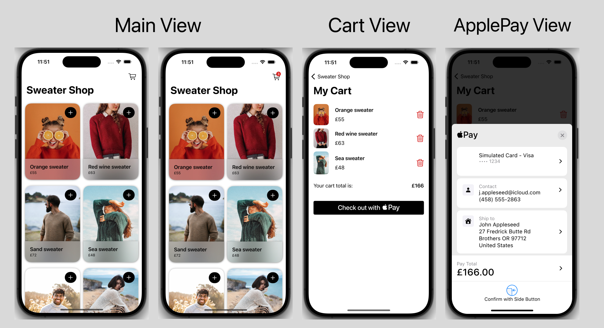

# eShopApp

eShopApp is an iOS shopping application built with SwiftUI. It allows users to browse and purchase items, manage a shopping cart, and make payments using Apple Pay.

# Screenshoot



## Features

- **Item Browsing and Purchase**: Explore a selection of products available for purchase.
- **Shopping Cart Management**: Add items to your cart or remove them as needed. The cart view displays selected items along with their prices and the total price.
- **Apple Pay Integration**: Easily complete purchases using Apple Pay. Please note that to test Apple Pay, you need an Apple Developer account. For security reasons, my account details are not included in this app.

## Getting Started

To clone and run this application, you'll need [Git](https://git-scm.com) installed on your computer. From your command line:

```bash
# Clone this repository
$ git clone https://github.com/OzgunEfe/eShopApp.git

# Go into the repository
$ cd eShopApp

# Open the project in Xcode
$ open eShopApp.xcodeproj
```

## Design Credits

- Thanks to [designcode.io](https://designcode.io) for the design inspiration.

